# CHƯƠNG 3: YÊU CẦU CHỨC NĂNG (DỰ ÁN FPMS)

## 3.1. Các tác nhân

Hệ thống Quản lý và Đặt sân bóng đá trực tuyến (Football Pitch Management System - FPMS) gồm có 4 tác nhân chính:
- **Khách hàng (Customer):** Người dùng có nhu cầu tìm kiếm sân, đặt lịch đá bóng, thanh toán tiền cọc, theo dõi lịch sử đặt và quản lý tài khoản cá nhân.
- **Nhân viên (Staff):** Người trực tiếp làm việc tại cơ sở sân bóng, phụ trách duyệt đơn, check-in nhận sân, quản lý ca đá thực tế, lập hóa đơn và thanh toán tại quầy.
- **Chủ sân (Admin / Pitch Owner):** Người quản trị toàn bộ hoạt động của hệ thống, quản lý danh mục sân, cấu hình khung giờ, thiết lập bảng giá thuê sân và xem báo cáo thống kê doanh thu.
- **Hệ thống thanh toán (Payment Gateway):** Cổng thanh toán trực tuyến bên thứ ba (VNPAY / MoMo) hỗ trợ xử lý giao dịch thanh toán tiền cọc an toàn.

---

## 3.2. Xác định các ca sử dụng

| STT | Ca sử dụng | Mô tả ngắn | Tác nhân |
| :---: | :--- | :--- | :--- |
| 1 | **Đăng nhập** | Đăng nhập bằng Email/SĐT và mật khẩu để sử dụng các chức năng theo vai trò | Khách hàng, Nhân viên, Chủ sân |
| 2 | **Đăng xuất** | Thoát khỏi phiên làm việc hiện tại và bảo mật tài khoản | Khách hàng, Nhân viên, Chủ sân |
| 3 | **Đăng ký tài khoản** | Đăng ký tài khoản thành viên mới trên hệ thống | Khách hàng |
| 4 | **Quản lý hồ sơ cá nhân** | Chỉnh sửa họ tên, số điện thoại, ảnh đại diện | Khách hàng, Nhân viên, Chủ sân |
| 5 | **Đặt lại mật khẩu** | Yêu cầu cấp lại mật khẩu qua mã xác thực OTP gửi về Email | Khách hàng |
| 6 | **Tra cứu thông tin sân** | Tìm kiếm sân bóng còn trống theo ngày, khung giờ và loại sân | Khách hàng |
| 7 | **Đặt sân trực tuyến** | Chọn sân, ca đá và nhập thông tin người đặt để tạo đơn giữ chỗ | Khách hàng |
| 8 | **Thanh toán tiền cọc** | Thực hiện thanh toán tiền đặt cọc (VD: 30%) ngay khi đặt sân qua hệ thống | Khách hàng, Hệ thống thanh toán |
| 9 | **Thanh toán** | Thanh toán phần tiền còn lại sau khi kết thúc ca đá | Khách hàng, Hệ thống thanh toán |
| 10 | **Quản lý đơn đặt sân cá nhân** | Xem lịch sử đơn đặt, lấy mã QR check-in hoặc yêu cầu hủy đơn | Khách hàng |
| 11 | **Quản lý đơn đặt sân** | Tiếp nhận, xác nhận đơn online hoặc tạo đơn trực tiếp cho khách tại quầy | Nhân viên, Chủ sân |
| 12 | **Quản lý ca đá** | Theo dõi bảng timeline lịch sân thời gian thực và quét mã QR nhận sân | Nhân viên |
| 13 | **Quản lý hoá đơn** | Tính tiền giờ sân và thanh toán tại quầy | Nhân viên |
| 14 | **Quản lý khách hàng** | Tra cứu thông tin, lịch sử đá bóng và phân loại khách hàng (VIP/Blacklist) | Nhân viên, Chủ sân |
| 15 | **Quản lý danh mục sân bóng** | Thêm mới, chỉnh sửa thông tin và cập nhật trạng thái bảo trì sân | Chủ sân |
| 16 | **Quản lý khung giờ** | Cấu hình các ca đá trong ngày và chỉ định khung giờ cao điểm (giờ vàng) | Chủ sân |
| 17 | **Quản lý bảng giá sân** | Thiết lập giá thuê sân theo loại sân, ngày thường/cuối tuần, khung giờ | Chủ sân |
| 18 | **Xem báo cáo thống kê** | Xem biểu đồ doanh thu, tần suất sử dụng sân và xuất file Excel | Chủ sân |

*Table 3.1 Xác định các ca sử dụng*

---

## 3.3. Biểu đồ use case

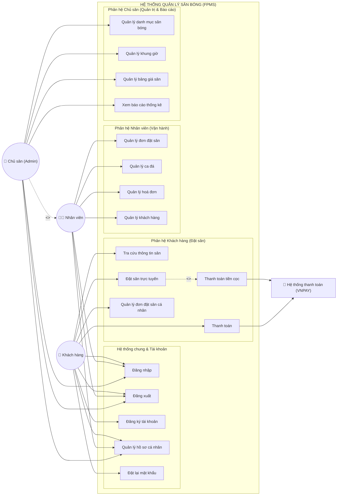

*Hình 3.1 Biểu đồ use case tổng quan*

---

## 3.4. Biểu đồ hoạt động, đặc tả use case và UI

---

### 3.4.1. Đăng nhập

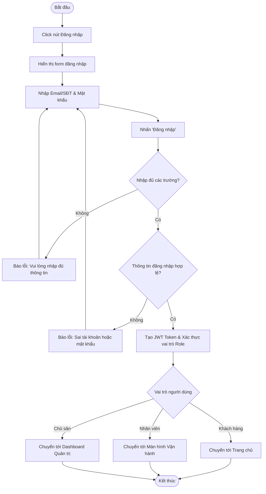
*Hình 3.2 Biểu đồ hoạt động đăng nhập*

| Thuộc tính | Chi tiết |
| :--- | :--- |
| **Mã Use case** | `UC001` |
| **Tên Use case** | **Đăng nhập** |
| **Tác nhân** | Khách hàng, Nhân viên, Chủ sân |
| **Sự kiện kích hoạt** | Click vào nút "Đăng nhập" trên giao diện |
| **Tiền điều kiện** | Người dùng đã có tài khoản hoạt động trong hệ thống |

**Luồng sự kiện chính (Thành công):**
| STT | Thực hiện bởi | Hành động |
| :---: | :--- | :--- |
| 1. | Người dùng | Chọn chức năng "Đăng nhập" |
| 2. | Hệ thống | Hiển thị giao diện form đăng nhập |
| 3. | Người dùng | Nhập Email/Số điện thoại và Mật khẩu |
| 4. | Người dùng | Nhấn nút "Đăng nhập" |
| 5. | Hệ thống | Kiểm tra xem người dùng đã nhập đủ các trường hay chưa |
| 6. | Hệ thống | Xác thực thông tin tài khoản và kiểm tra mật khẩu đã mã hóa (BCrypt) |
| 7. | Hệ thống | Cấp JWT Token và điều hướng người dùng tới trang nghiệp vụ tương ứng theo vai trò |

**Luồng sự kiện thay thế:**
| STT | Thực hiện bởi | Hành động |
| :---: | :--- | :--- |
| 5a. | Hệ thống | Thông báo lỗi: Cần nhập đầy đủ Email/SĐT và Mật khẩu |
| 6a. | Hệ thống | Thông báo lỗi: Thông tin đăng nhập hoặc mật khẩu không chính xác |
| 6b. | Hệ thống | Thông báo lỗi: Tài khoản đã bị khóa hoặc ngừng hoạt động |

**Hậu điều kiện:** Người dùng đăng nhập thành công vào hệ thống.  
*Table 3.2 Đặc tả use case đăng nhập*

```text
+-----------------------------------------------------------------------------------------+
|                                    [ ĐĂNG NHẬP ]                                        |
|                                                                                         |
|    Email hoặc Số điện thoại (*):                                                        |
|    [ giapnh@example.com                                              ]                  |
|                                                                                         |
|    Mật khẩu (*):                                                                        |
|    [ **********                                                   (o)]                  |
|                                                                                         |
|    [X] Ghi nhớ đăng nhập                                      Quên mật khẩu?            |
|                                                                                         |
|    +-------------------------------------------------------------------------------+    |
|    |                                [ ĐĂNG NHẬP ]                                  |    |
|    +-------------------------------------------------------------------------------+    |
|                                                                                         |
|    Chưa có tài khoản? [Đăng ký ngay]                                                    |
+-----------------------------------------------------------------------------------------+
```
*Hình 3.3 UI đăng nhập*

---

### 3.4.2. Đăng xuất

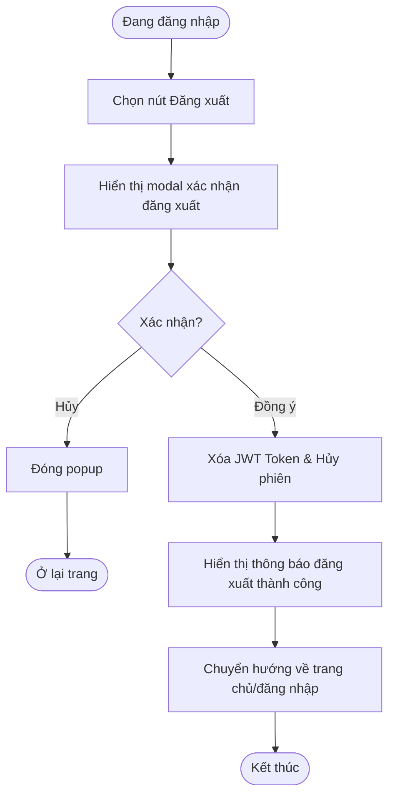
*Hình 3.4 Biểu đồ hoạt động đăng xuất*

| Thuộc tính | Chi tiết |
| :--- | :--- |
| **Mã Use case** | `UC002` |
| **Tên Use case** | **Đăng xuất** |
| **Tác nhân** | Khách hàng, Nhân viên, Chủ sân |
| **Sự kiện kích hoạt** | Click vào mục "Đăng xuất" tại menu cá nhân |
| **Tiền điều kiện** | Người dùng đang trong trạng thái đăng nhập |

**Luồng sự kiện chính (Thành công):**
| STT | Thực hiện bởi | Hành động |
| :---: | :--- | :--- |
| 1. | Người dùng | Chọn chức năng "Đăng xuất" từ menu cá nhân |
| 2. | Hệ thống | Hiển thị hộp thoại xác nhận đăng xuất |
| 3. | Người dùng | Nhấn "Xác nhận" |
| 4. | Hệ thống | Xóa Token lưu trữ tại trình duyệt, hủy phiên làm việc và hiển thị giao diện trang chủ ở trạng thái khách vãng lai |

**Luồng sự kiện thay thế:**
| STT | Thực hiện bởi | Hành động |
| :---: | :--- | :--- |
| 3a. | Người dùng | Bấm nút "Hủy bỏ" hoặc đóng cửa sổ xác nhận -> Giữ nguyên phiên đăng nhập |

**Hậu điều kiện:** Người dùng đăng xuất thành công khỏi hệ thống.  
*Table 3.3 Đặc tả use case đăng xuất*

```text
+-----------------------------------------------------------------------------------------+
|                                XÁC NHẬN ĐĂNG XUẤT                                       |
|                                                                                         |
|        Bạn có chắc chắn muốn đăng xuất khỏi hệ thống sân bóng FPMS không?               |
|                                                                                         |
|                      [ Hủy bỏ ]          [ Đăng xuất ]                                  |
+-----------------------------------------------------------------------------------------+
```
*Hình 3.5 UI đăng xuất*

---

### 3.4.3. Đăng ký tài khoản

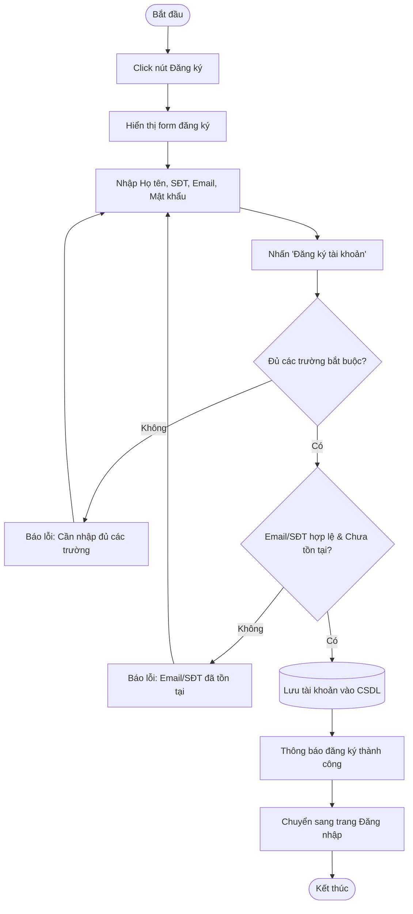
*Hình 3.6 Biểu đồ hoạt động đăng ký tài khoản*

| Thuộc tính | Chi tiết |
| :--- | :--- |
| **Mã Use case** | `UC003` |
| **Tên Use case** | **Đăng ký tài khoản** |
| **Tác nhân** | Khách hàng |
| **Sự kiện kích hoạt** | Click vào nút "Đăng ký" trên giao diện |
| **Tiền điều kiện** | Người dùng chưa có tài khoản trong hệ thống |

**Luồng sự kiện chính (Thành công):**
| STT | Thực hiện bởi | Hành động |
| :---: | :--- | :--- |
| 1. | Khách hàng | Chọn chức năng "Đăng ký" |
| 2. | Hệ thống | Hiển thị giao diện form đăng ký tài khoản |
| 3. | Khách hàng | Nhập thông tin: Họ tên, Số điện thoại, Email, Mật khẩu, Xác nhận mật khẩu |
| 4. | Khách hàng | Nhấn nút "Đăng ký tài khoản" |
| 5. | Hệ thống | Kiểm tra các trường thông tin bắt buộc |
| 6. | Hệ thống | Kiểm tra định dạng Email/SĐT và kiểm tra tính duy nhất trong CSDL |
| 7. | Hệ thống | Mã hóa mật khẩu (BCrypt), lưu tài khoản mới vào cơ sở dữ liệu |
| 8. | Hệ thống | Hiển thị thông báo đăng ký thành công và điều hướng sang trang Đăng nhập |

**Luồng sự kiện thay thế:**
| STT | Thực hiện bởi | Hành động |
| :---: | :--- | :--- |
| 5a. | Hệ thống | Thông báo lỗi: Cần nhập đầy đủ các trường bắt buộc nếu nhập thiếu |
| 6a. | Hệ thống | Thông báo lỗi: Email hoặc Số điện thoại đã được đăng ký trong hệ thống |
| 6b. | Hệ thống | Thông báo lỗi: Xác nhận mật khẩu không trùng khớp |

**Hậu điều kiện:** Tài khoản mới được tạo và lưu trữ thành công vào hệ thống.  
*Table 3.4 Đặc tả use case đăng ký tài khoản*

```text
+-----------------------------------------------------------------------------------------+
|                                    [ FORM ĐĂNG KÝ ]                                     |
|                                                                                         |
|    Họ và tên (*):        [ Nguyễn Hữu Giáp                                   ]          |
|    Số điện thoại (*):    [ 0987654321                                        ]          |
|    Email (*):            [ giapnh@example.com                                ]          |
|    Mật khẩu (*):         [ **********                                    (o) ]          |
|    Nhập lại mật khẩu (*):[ **********                                    (o) ]          |
|                                                                                         |
|    [X] Tôi đồng ý với Điều khoản sử dụng và Chính sách đặt sân                          |
|                                                                                         |
|    +-------------------------------------------------------------------------------+    |
|    |                             [ ĐĂNG KÝ TÀI KHOẢN ]                             |    |
|    +-------------------------------------------------------------------------------+    |
|                                                                                         |
|    Đã có tài khoản? [Đăng nhập ngay]                                                    |
+-----------------------------------------------------------------------------------------+
```
*Hình 3.7 UI đăng ký tài khoản*

---

### 3.4.4. Quản lý hồ sơ cá nhân

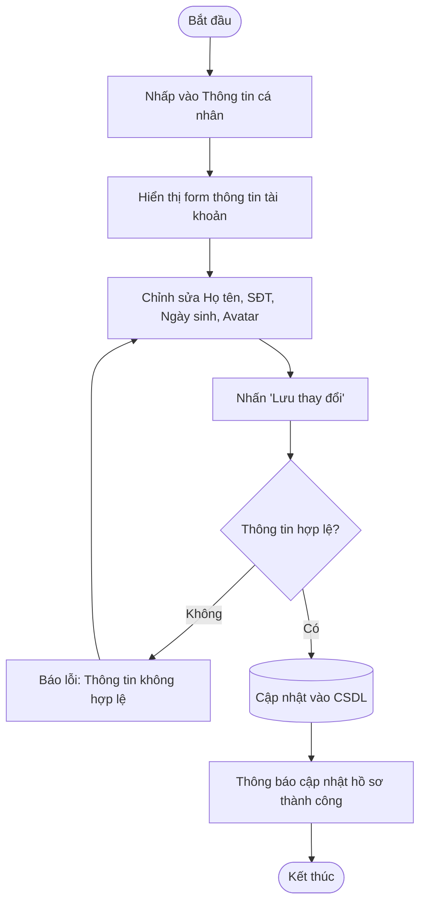
*Hình 3.8 Biểu đồ hoạt động quản lý hồ sơ cá nhân*

| Thuộc tính | Chi tiết |
| :--- | :--- |
| **Mã Use case** | `UC004` |
| **Tên Use case** | **Quản lý hồ sơ cá nhân** |
| **Tác nhân** | Khách hàng, Nhân viên, Chủ sân |
| **Sự kiện kích hoạt** | Click vào mục "Thông tin cá nhân" trong menu tài khoản |
| **Tiền điều kiện** | Người dùng đã đăng nhập vào hệ thống |

**Luồng sự kiện chính (Thành công):**
| STT | Thực hiện bởi | Hành động |
| :---: | :--- | :--- |
| 1. | Người dùng | Chọn chức năng "Thông tin cá nhân" |
| 2. | Hệ thống | Hiển thị biểu mẫu thông tin cá nhân hiện tại |
| 3. | Người dùng | Chỉnh sửa các trường thông tin (Họ tên, SĐT, Ảnh đại diện) |
| 4. | Người dùng | Nhấn nút "Lưu thay đổi" |
| 5. | Hệ thống | Kiểm tra tính hợp lệ của dữ liệu |
| 6. | Hệ thống | Cập nhật thông tin vào cơ sở dữ liệu và hiển thị thông báo thành công |

**Luồng sự kiện thay thế:**
| STT | Thực hiện bởi | Hành động |
| :---: | :--- | :--- |
| 4a. | Người dùng | Nhấn "Hủy bỏ" -> Không lưu thay đổi |
| 5a. | Hệ thống | Thông báo lỗi: Số điện thoại không đúng định dạng 10 số |

**Hậu điều kiện:** Dữ liệu cá nhân của người dùng được cập nhật thành công.  
*Table 3.5 Đặc tả use case quản lý hồ sơ cá nhân*

```text
+-----------------------------------------------------------------------------------------+
|                                 THÔNG TIN CÁ NHÂN                                       |
|                                                                                         |
|       [ Ảnh đại diện ]   [ Thay đổi ảnh ]                                               |
|                                                                                         |
|       Họ và tên:          [ Nguyễn Hữu Giáp                                  ]          |
|       Email (Cố định):    [ giapnh@example.com                               ]          |
|       Số điện thoại:      [ 0987654321                                       ]          |
|       Ngày sinh:          [ 01/02/2002                                       ]          |
|                                                                                         |
|                                [ Hủy bỏ ]   [ Lưu thay đổi ]                            |
+-----------------------------------------------------------------------------------------+
```
*Hình 3.9 UI quản lý hồ sơ cá nhân*

---

### 3.4.5. Đặt lại mật khẩu

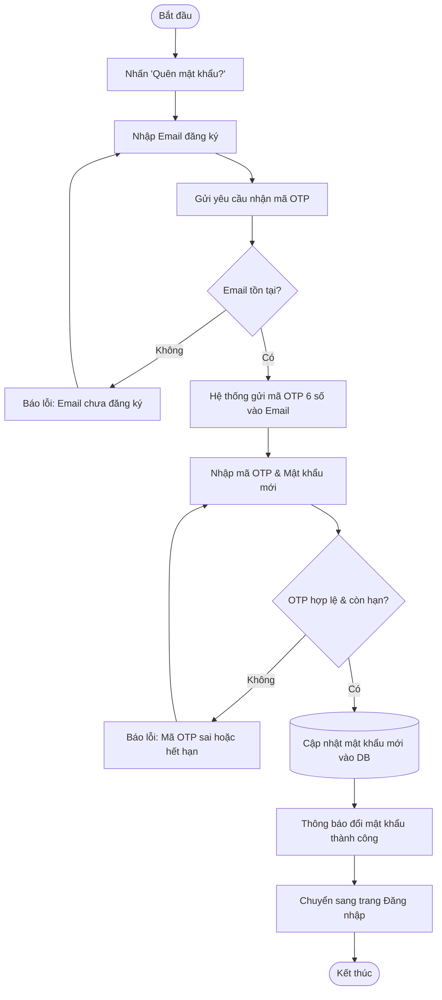
*Hình 3.10 Biểu đồ hoạt động đặt lại mật khẩu*

| Thuộc tính | Chi tiết |
| :--- | :--- |
| **Mã Use case** | `UC005` |
| **Tên Use case** | **Đặt lại mật khẩu** |
| **Tác nhân** | Khách hàng |
| **Sự kiện kích hoạt** | Click vào link "Quên mật khẩu?" tại trang Đăng nhập |
| **Tiền điều kiện** | Khách hàng có email đăng ký trong hệ thống |

**Luồng sự kiện chính (Thành công):**
| STT | Thực hiện bởi | Hành động |
| :---: | :--- | :--- |
| 1. | Khách hàng | Chọn "Quên mật khẩu" |
| 2. | Hệ thống | Hiển thị giao diện yêu cầu nhập Email |
| 3. | Khách hàng | Nhập Email và nhấn "Gửi mã OTP" |
| 4. | Hệ thống | Tạo mã OTP 6 số và gửi qua Email |
| 5. | Khách hàng | Nhập mã OTP nhận được cùng mật khẩu mới |
| 6. | Hệ thống | Kiểm tra mã OTP hợp lệ |
| 7. | Hệ thống | Cập nhật mật khẩu mới và thông báo thành công |

**Luồng sự kiện thay thế:**
| STT | Thực hiện bởi | Hành động |
| :---: | :--- | :--- |
| 3a. | Hệ thống | Thông báo lỗi: Email không tồn tại trong hệ thống |
| 6a. | Hệ thống | Thông báo lỗi: Mã OTP không chính xác hoặc đã hết hạn (quá 5 phút) |

**Hậu điều kiện:** Mật khẩu được cập nhật mới thành công.  
*Table 3.6 Đặc tả use case đặt lại mật khẩu*

```text
+-----------------------------------------------------------------------------------------+
|                                 ĐẶT LẠI MẬT KHẨU                                        |
|                                                                                         |
|    Bước 1: Nhập Email xác thực                                                          |
|    Email:               [ giapnh@example.com                ]   [ Gửi mã OTP ]          |
|                                                                                         |
|    Bước 2: Nhập OTP & Mật khẩu mới                                                      |
|    Mã OTP (6 chữ số):   [ 4 8 2 9 1 0 ]                                                 |
|    Mật khẩu mới:        [ **********                                    (o) ]          |
|    Nhập lại MK mới:     [ **********                                    (o) ]          |
|                                                                                         |
|    +-------------------------------------------------------------------------------+    |
|    |                             [ XÁC NHẬN ĐỔI MẬT KHẨU ]                         |    |
|    +-------------------------------------------------------------------------------+    |
+-----------------------------------------------------------------------------------------+
```
*Hình 3.11 UI đặt lại mật khẩu*

---

### 3.4.6. Tra cứu thông tin sân

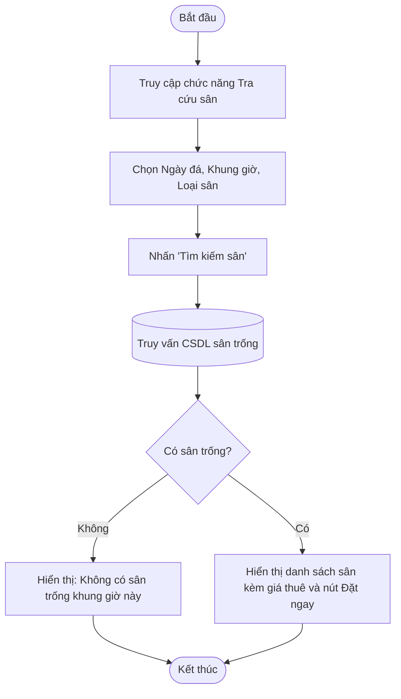
*Hình 3.12 Biểu đồ hoạt động tra cứu thông tin sân*

| Thuộc tính | Chi tiết |
| :--- | :--- |
| **Mã Use case** | `UC006` |
| **Tên Use case** | **Tra cứu thông tin sân** |
| **Tác nhân** | Khách hàng |
| **Sự kiện kích hoạt** | Nhập tiêu chí tìm kiếm và nhấn "Tìm kiếm sân" |
| **Tiền điều kiện** | Thiết bị có kết nối Internet |

**Luồng sự kiện chính (Thành công):**
| STT | Thực hiện bởi | Hành động |
| :---: | :--- | :--- |
| 1. | Khách hàng | Chọn ngày đá, khung giờ mong muốn, loại sân (5/7/11) |
| 2. | Khách hàng | Nhấn "Tìm kiếm sân" |
| 3. | Hệ thống | Kiểm tra tình trạng sân trống trong CSDL |
| 4. | Hệ thống | Hiển thị danh sách các sân còn trống kèm giá tiền và thông tin chi tiết |

**Luồng sự kiện thay thế:**
| STT | Thực hiện bởi | Hành động |
| :---: | :--- | :--- |
| 3a. | Hệ thống | Thông báo: Hiện tại tất cả các sân trong khung giờ này đã kín lịch. Gợi ý khung giờ khác. |

**Hậu điều kiện:** Hiển thị kết quả tra cứu sân bóng.  
*Table 3.7 Đặc tả use case tra cứu thông tin sân*

```text
+-----------------------------------------------------------------------------------------+
|  TÌM KIẾM SÂN BÓNG                                                                      |
|  Ngày đá: [ 22/08/2026 ]  Khung giờ: [ 17:30 - 19:00 v ]  Loại sân: [ Sân 5 v ] [Tìm]   |
|                                                                                         |
|  KẾT QUẢ TÌM KIẾM (2 sân khả dụng):                                                     |
|  +-------------------------------------+  +-------------------------------------+       |
|  | SÂN 5A - SỐ 1                       |  | SÂN 5A - SỐ 2                       |       |
|  | - Vị trí: Khu A (Cỏ nhân tạo 5cm)   |  | - Vị trí: Khu A (Cỏ nhân tạo 5cm)   |       |
|  | - Đơn giá: 350.000 đ / 90 phút      |  | - Đơn giá: 350.000 đ / 90 phút      |       |
|  | - Trạng thái: [ CÒN TRỐNG ]         |  | - Trạng thái: [ CÒN TRỐNG ]         |       |
|  | [ Xem chi tiết ]   [ ĐẶT SÂN NGAY ] |  | [ Xem chi tiết ]   [ ĐẶT SÂN NGAY ] |       |
|  +-------------------------------------+  +-------------------------------------+       |
+-----------------------------------------------------------------------------------------+
```
*Hình 3.13 UI tra cứu thông tin sân*

---

### 3.4.7. Đặt sân trực tuyến

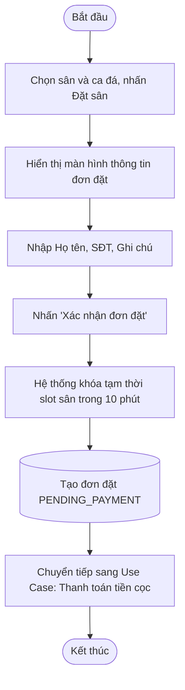
*Hình 3.14 Biểu đồ hoạt động đặt sân trực tuyến*

| Thuộc tính | Chi tiết |
| :--- | :--- |
| **Mã Use case** | `UC007` |
| **Tên Use case** | **Đặt sân trực tuyến** |
| **Tác nhân** | Khách hàng |
| **Sự kiện kích hoạt** | Nhấn nút "Đặt sân ngay" trên sân đã chọn |
| **Tiền điều kiện** | Khách hàng đã đăng nhập, sân bóng còn trống |

**Luồng sự kiện chính (Thành công):**
| STT | Thực hiện bởi | Hành động |
| :---: | :--- | :--- |
| 1. | Khách hàng | Chọn sân bóng, ngày đá, ca đá và nhấn "Đặt sân ngay" |
| 2. | Hệ thống | Hiển thị màn hình xác nhận thông tin đơn đặt và số tiền cọc (30%) |
| 3. | Khách hàng | Điền/kiểm tra thông tin người đặt (Họ tên, SĐT) và ghi chú |
| 4. | Khách hàng | Nhấn "Xác nhận đặt sân & Tiến hành thanh toán cọc" |
| 5. | Hệ thống | Khóa tạm thời khung giờ của sân trong 10 phút để tránh bị đặt trùng |
| 6. | Hệ thống | Tạo bản ghi đơn đặt ở trạng thái `PENDING_PAYMENT` và chuyển sang giao diện thanh toán cọc |

**Luồng sự kiện thay thế:**
| STT | Thực hiện bởi | Hành động |
| :---: | :--- | :--- |
| 5a. | Hệ thống | Báo lỗi: Khung giờ này vừa có người khác đặt trước. Vui lòng chọn sân hoặc giờ khác. |

**Hậu điều kiện:** Đơn đặt sân được khởi tạo thành công và chuyển sang bước thanh toán tiền cọc.  
*Table 3.8 Đặc tả use case đặt sân trực tuyến*

```text
+-----------------------------------------------------------------------------------------+
|                                 XÁC NHẬN ĐƠN ĐẶT SÂN                                    |
|                                                                                         |
|  [THÔNG TIN SÂN & THỜI GIAN]                       [THÔNG TIN NGƯỜI ĐẶT]                |
|  - Sân bóng:   Sân 5A - Số 1                       - Họ và tên (*):                     |
|  - Loại sân:   Sân 5 người                         [ Nguyễn Hữu Giáp                  ] |
|  - Ngày đá:    22/08/2026                          - Số điện thoại (*):                 |
|  - Khung giờ:  17:30 - 19:00 (90 phút)             [ 0987654321                       ] |
|  - Giá thuê:   350.000 đ                           - Ghi chú:                           |
|                                                    [ Mượn thêm 2 bộ áo pitch          ] |
|                                                                                         |
|                        +---------------------------------------+                        |
|                        | [ TIẾP TỤC ĐẾN BƯỚC THANH TOÁN (CỌC) ]|                        |
|                        +---------------------------------------+                        |
+-----------------------------------------------------------------------------------------+
```
*Hình 3.15 UI đặt sân trực tuyến*

---

### 3.4.8. Thanh toán tiền cọc

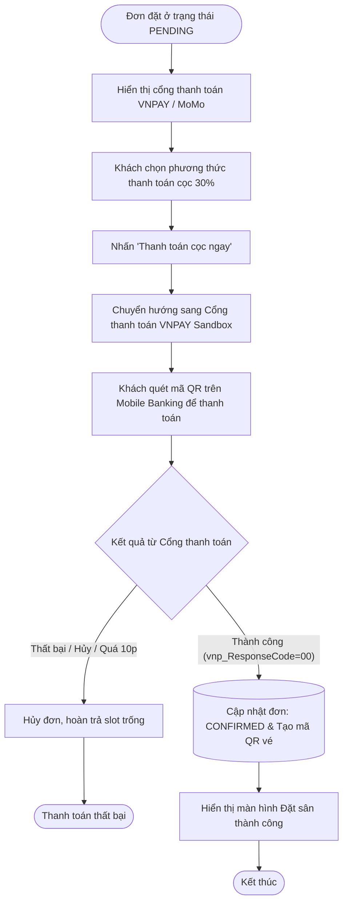
*Hình 3.16 Biểu đồ hoạt động thanh toán tiền cọc*

| Thuộc tính | Chi tiết |
| :--- | :--- |
| **Mã Use case** | `UC008` |
| **Tên Use case** | **Thanh toán tiền cọc** |
| **Tác nhân** | Khách hàng, Hệ thống thanh toán (VNPAY / MoMo) |
| **Sự kiện kích hoạt** | Nhấn nút "Thanh toán cọc ngay" |
| **Tiền điều kiện** | Đơn đặt sân đang ở trạng thái `PENDING_PAYMENT` |

**Luồng sự kiện chính (Thành công):**
| STT | Thực hiện bởi | Hành động |
| :---: | :--- | :--- |
| 1. | Khách hàng | Chọn hình thức thanh toán: VNPAY QR / Ví MoMo / Thẻ ATM |
| 2. | Khách hàng | Nhấn "Thanh toán cọc ngay" |
| 3. | Hệ thống | Sinh mã giao dịch và tạo URL chuyển tiếp sang Cổng thanh toán VNPAY |
| 4. | Khách hàng | Thực hiện quét mã QR thanh toán trên ứng dụng ngân hàng |
| 5. | Hệ thống thanh toán | Gửi kết quả xác nhận giao dịch thành công (IPN Webhook) về FPMS Backend |
| 6. | Hệ thống | Cập nhật đơn đặt sang trạng thái `CONFIRMED`, ghi nhận giao dịch cọc, cấp mã QR vé và hiển thị thông báo thành công |

**Luồng sự kiện thay thế:**
| STT | Thực hiện bởi | Hành động |
| :---: | :--- | :--- |
| 4a. | Khách hàng | Hủy thanh toán hoặc quá thời gian 10 phút -> Hệ thống tự động hủy đơn và mở lại slot sân |
| 5a. | Hệ thống thanh toán | Báo lỗi giao dịch không thành công (không đủ số dư, lỗi thẻ) -> Hệ thống thông báo lỗi và cho phép thử lại |

**Hậu điều kiện:** Tiền đặt cọc được thanh toán, đơn đặt sân được chuyển sang trạng thái đã đặt cọc thành công.  
*Table 3.9 Đặc tả use case thanh toán tiền cọc*

```text
+-----------------------------------------------------------------------------------------+
|                                 THANH TOÁN TIỀN CỌC ĐẶT SÂN                             |
|                                                                                         |
|  [THÔNG TIN THANH TOÁN]                                                                 |
|  - Mã đơn đặt:        #BK20260822-01                                                    |
|  - Tổng tiền thuê sân: 350.000 đ                                                        |
|  - Tỷ lệ cọc quy định: 30%                                                              |
|  -------------------------------------------------------------------------------------  |
|  - SỐ TIỀN CỌC CẦN THANH TOÁN:                                            105.000 đ     |
|  - Số tiền còn lại trả tại sân:                                           245.000 đ     |
|  -------------------------------------------------------------------------------------  |
|                                                                                         |
|  CHỌN PHƯƠNG THỨC THANH TOÁN:                                                          |
|  (*) Cổng VNPAY QR (Quét mã mọi ngân hàng)                                              |
|  ( ) Ví điện tử MoMo                                                                    |
|  ( ) Thẻ ATM Nội địa / Internet Banking                                                 |
|                                                                                         |
|                        +---------------------------------------+                        |
|                        |    [ 💳 TIẾN HÀNH THANH TOÁN 105.000đ ]|                       |
|                        +---------------------------------------+                        |
+-----------------------------------------------------------------------------------------+
```
*Hình 3.17 UI thanh toán tiền cọc*

---


---

### 3.4.9. Thanh toán (Phần còn lại)

`mermaid
flowchart TD
    Start([Khách kết thúc ca đá]) --> CheckInvoice[Khách hoặc nhân viên xem hoá đơn cuối]
    CheckInvoice --> ChoosePayFinal[Chọn thanh toán phần còn lại]
    ChoosePayFinal --> RedirectPayFinal[Chuyển hướng cổng thanh toán]
    RedirectPayFinal --> ScanQRFinal[Quét mã QR thanh toán]
    ScanQRFinal --> IPNCallbackFinal{Kết quả thanh toán}
    IPNCallbackFinal -- Thất bại --> PayFailFinal[Báo lỗi, yêu cầu thử lại] --> ScanQRFinal
    IPNCallbackFinal -- Thành công --> PaySuccessFinal[(Cập nhật đơn: HOÀN THÀNH)]
    PaySuccessFinal --> EndFinal([Kết thúc])
`
*Hình 3.18 Biểu đồ hoạt động thanh toán phần còn lại*

| Thuộc tính | Chi tiết |
| :--- | :--- |
| **Mã Use case** | UC009 |
| **Tên Use case** | **Thanh toán (Phần còn lại)** |
| **Tác nhân** | Khách hàng, Hệ thống thanh toán |
| **Sự kiện kích hoạt** | Nhấn nút "Thanh toán hóa đơn" sau ca đá |
| **Tiền điều kiện** | Đơn đặt sân đang ở trạng thái CHỜ_THANH_TOÁN_NỐT |

**Luồng sự kiện chính (Thành công):**
| STT | Thực hiện bởi | Hành động |
| :---: | :--- | :--- |
| 1. | Khách hàng | Kiểm tra tổng hóa đơn |
| 2. | Khách hàng | Chọn phương thức và nhấn "Thanh toán" |
| 3. | Hệ thống | Chuyển hướng sang hệ thống thanh toán |
| 4. | Hệ thống TT | Xử lý và trả về kết quả thành công |
| 5. | Hệ thống | Cập nhật đơn đặt sang HOÀN_THÀNH và trạng thái thanh toán là ĐÃ_HOÀN_TẤT |

**Luồng sự kiện thay thế:**
| STT | Thực hiện bởi | Hành động |
| :---: | :--- | :--- |
| 2a. | Khách hàng | Chọn thanh toán tiền mặt tại quầy -> Nhân viên xác nhận thu tiền và đóng đơn. |

**Hậu điều kiện:** Hóa đơn được thanh toán đầy đủ, đơn đặt sân hoàn tất.  
*Table 3.10 Đặc tả use case thanh toán phần còn lại*

`	ext
+-----------------------------------------------------------------------------------------+
|                                 THANH TOÁN HÓA ĐƠN CUỐI                                 |
+-----------------------------------------------------------------------------------------+
`
*Hình 3.19 UI thanh toán phần còn lại*

### 3.4.10. Quản lý đơn đặt sân cá nhân

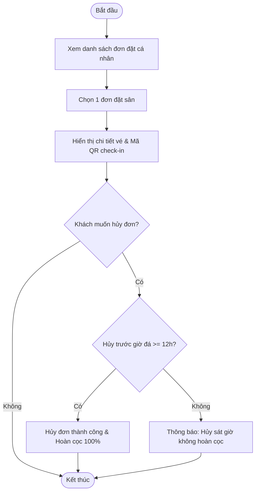
*Hình 3.20 Biểu đồ hoạt động quản lý đơn đặt sân cá nhân*

| Thuộc tính | Chi tiết |
| :--- | :--- |
| **Mã Use case** | `UC010` |
| **Tên Use case** | **Quản lý đơn đặt sân cá nhân** |
| **Tác nhân** | Khách hàng |
| **Sự kiện kích hoạt** | Chọn mục "Lịch sử đặt sân" trên menu tài khoản |
| **Tiền điều kiện** | Khách hàng đã đăng nhập |

**Luồng sự kiện chính (Thành công):**
| STT | Thực hiện bởi | Hành động |
| :---: | :--- | :--- |
| 1. | Khách hàng | Chọn chức năng "Lịch sử đặt sân" |
| 2. | Hệ thống | Hiển thị danh sách các đơn đặt: Sắp diễn ra, Đã hoàn thành, Đã hủy |
| 3. | Khách hàng | Chọn xem chi tiết một đơn đặt |
| 4. | Hệ thống | Hiển thị chi tiết vé kèm Mã QR check-in để xuất trình khi đến sân |

**Luồng sự kiện thay thế:**
| STT | Thực hiện bởi | Hành động |
| :---: | :--- | :--- |
| 3a. | Khách hàng | Chọn "Yêu cầu hủy đơn" -> Hệ thống đối soát thời gian quy định và cập nhật trạng thái hủy |

**Hậu điều kiện:** Khách hàng theo dõi và quản lý được các vé đặt sân cá nhân.  
*Table 3.11 Đặc tả use case quản lý đơn đặt sân cá nhân*

```text
+-----------------------------------------------------------------------------------------+
|  LỊCH SỬ ĐẶT SÂN CỦA TÔI                                                                |
|                                                                                         |
|  +--------------------+----------------+---------------+-------------+---------------+  |
|  | Mã vé              | Sân bóng       | Ngày đá       | Khung giờ   | Trạng thái    |  |
|  +--------------------+----------------+---------------+-------------+---------------+  |
|  | #BK20260822-01     | Sân 5A - Số 1  | 22/08/2026    | 17:30-19:00 | [ ĐÃ CỌC ]    |  |
|  | #BK20260815-09     | Sân 7B - VIP   | 15/08/2026    | 19:00-20:30 | [ HOÀN THÀNH] |  |
|  +--------------------+----------------+---------------+-------------+---------------+  |
|                                                                                         |
|  CHI TIẾT VÉ #BK20260822-01:                           [ MÃ QR CHECK-IN TẠI SÂN ]       |
|  - Khách hàng: Nguyễn Hữu Giáp - 0987654321            +------------------------+       |
|  - Tiền cọc đã trả: 105.000 đ                          |  [ MÃ QR CODE TẠI ĐÂY ]|       |
|  - Số tiền thanh toán tại sân: 245.000 đ               +------------------------+       |
|  [ HỦY ĐẶT SÂN ]                                       Xuất trình mã này cho nhân viên  |
+-----------------------------------------------------------------------------------------+
```
*Hình 3.21 UI quản lý đơn đặt sân cá nhân*

---

### 3.4.11. Quản lý đơn đặt sân (Phân hệ Nhân viên)

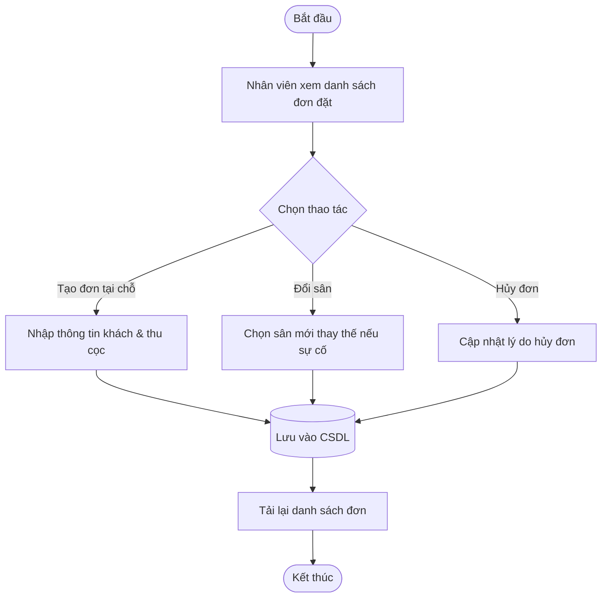
*Hình 3.22 Biểu đồ hoạt động quản lý đơn đặt sân của nhân viên*

| Thuộc tính | Chi tiết |
| :--- | :--- |
| **Mã Use case** | `UC011` |
| **Tên Use case** | **Quản lý đơn đặt sân** |
| **Tác nhân** | Nhân viên, Chủ sân |
| **Sự kiện kích hoạt** | Truy cập menu "Quản lý đơn đặt" |
| **Tiền điều kiện** | Nhân viên đã đăng nhập tài khoản quyền Staff |

**Luồng sự kiện chính (Thành công):**
| STT | Thực hiện bởi | Hành động |
| :---: | :--- | :--- |
| 1. | Nhân viên | Chọn chức năng "Quản lý đơn đặt sân" |
| 2. | Hệ thống | Hiển thị bảng danh sách đơn đặt theo ngày và trạng thái |
| 3. | Nhân viên | Thực hiện tiếp nhận đơn, tạo đơn đặt mới cho khách vãng lai hoặc đổi sân khi có yêu cầu |
| 4. | Hệ thống | Cập nhật dữ liệu vào CSDL và thông báo thành công |

**Luồng sự kiện thay thế:**
| STT | Thực hiện bởi | Hành động |
| :---: | :--- | :--- |
| 3a. | Nhân viên | Hủy thao tác -> Hệ thống giữ nguyên trạng thái đơn |

**Hậu điều kiện:** Đơn đặt sân được cập nhật chính xác.  
*Table 3.12 Đặc tả use case quản lý đơn đặt sân của nhân viên*

```text
+-----------------------------------------------------------------------------------------+
|  FPMS STAFF | QUẢN LÝ ĐƠN ĐẶT SÂN                               [ + Tạo đơn tại chỗ ]   |
|                                                                                         |
|  Tìm kiếm: [ SĐT / Tên khách... ]   Ngày: [ 22/08/2026 ]   Trạng thái: [ Tất cả v ]     |
|  +----+--------------+---------------+-------------+------------+----------+----------+ |
|  | STT| Tên khách    | Sân           | Khung giờ   | Tiền cọc   |Trạng thái| Thao tác | |
|  +----+--------------+---------------+-------------+------------+----------+----------+ |
|  | 01 | Nguyễn H.Giáp| Sân 5A - Số 1 | 17:30-19:00 | 105.000 đ  | Đã cọc   | [Đổi sân]| |
|  | 02 | Trần Văn Nam | Sân 5A - Số 2 | 19:00-20:30 | 105.000 đ  | Đã cọc   | [Hủy đơn]| |
|  +----+--------------+---------------+-------------+------------+----------+----------+ |
+-----------------------------------------------------------------------------------------+
```
*Hình 3.23 UI quản lý đơn đặt sân của nhân viên*

---

### 3.4.12. Quản lý ca đá

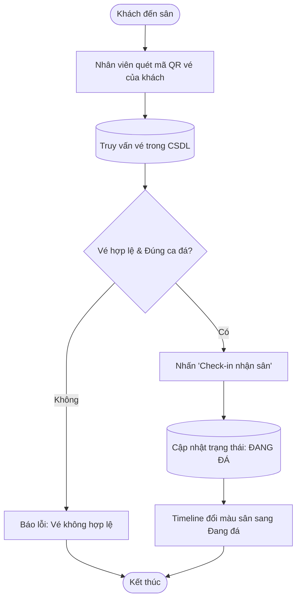
*Hình 3.24 Biểu đồ hoạt động quản lý ca đá*

| Thuộc tính | Chi tiết |
| :--- | :--- |
| **Mã Use case** | `UC012` |
| **Tên Use case** | **Quản lý ca đá** |
| **Tác nhân** | Nhân viên |
| **Sự kiện kích hoạt** | Quét mã QR hoặc chọn ca đá trên timeline |
| **Tiền điều kiện** | Nhân viên đã đăng nhập |

**Luồng sự kiện chính (Thành công):**
| STT | Thực hiện bởi | Hành động |
| :---: | :--- | :--- |
| 1. | Nhân viên | Mở chức năng quét mã QR check-in ca đá |
| 2. | Nhân viên | Quét mã QR vé trên điện thoại của khách hàng |
| 3. | Hệ thống | Kiểm tra thông tin vé, hiển thị thông tin ca đá và số tiền còn lại |
| 4. | Nhân viên | Nhấn "Xác nhận nhận sân" |
| 5. | Hệ thống | Chuyển trạng thái ca đá sang "Đang đá" trên bảng timeline thời gian thực |

**Luồng sự kiện thay thế:**
| STT | Thực hiện bởi | Hành động |
| :---: | :--- | :--- |
| 3a. | Hệ thống | Thông báo lỗi: Vé đã được sử dụng hoặc sai ngày/giờ |

**Hậu điều kiện:** Khách hàng nhận sân thành công, ca đá bắt đầu.  
*Table 3.13 Đặc tả use case quản lý ca đá*

```text
+-----------------------------------------------------------------------------------------+
|  BẢNG TIMELINE CA ĐÁ THỜI GIAN THỰC                         [ 📷 QUÉT MÃ QR CHECK-IN ]  |
|  Chú thích: [ Trắng: Trống ]  [ Vàng: Đã cọc ]  [ Xanh: Đang đá ]  [ Xám: Đã đá xong ]  |
|                                                                                         |
|  +--------------+---------------+---------------+---------------+---------------+       |
|  | SÂN / CA     | 06:00 - 07:30 | 16:00 - 17:30 | 17:30 - 19:00 | 19:00 - 20:30 |       |
|  +--------------+---------------+---------------+---------------+---------------+       |
|  | Sân 5A - Số 1| [ Trống ]     | [ĐÃ CỌC - Nam]| [ĐANG ĐÁ-Giáp]| [ĐÃ CỌC -Huy] |       |
|  | Sân 5A - Số 2| [ Trống ]     | [ Trống ]     | [ĐANG ĐÁ-Tuấn]| [ĐÃ CỌC -Sơn] |       |
|  | Sân 7B - VIP | [ Trống ]     | [ĐÃ CỌC- Minh]| [ĐANG ĐÁ-FC Hà]| [ĐÃ CỌC-FC ĐN]|       |
|  +--------------+---------------+---------------+---------------+---------------+       |
+-----------------------------------------------------------------------------------------+
```
*Hình 3.25 UI quản lý ca đá*

---

### 3.4.13. Quản lý hoá đơn

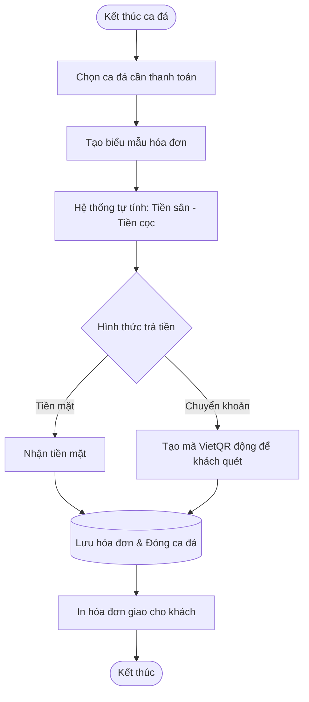
*Hình 3.26 Biểu đồ hoạt động quản lý hoá đơn*

| Thuộc tính | Chi tiết |
| :--- | :--- |
| **Mã Use case** | `UC013` |
| **Tên Use case** | **Quản lý hoá đơn** |
| **Tác nhân** | Nhân viên |
| **Sự kiện kích hoạt** | Nhấn "Thanh toán" khi ca đá kết thúc |
| **Tiền điều kiện** | Ca đá đang ở trạng thái Đang đá hoặc Hoàn thành giờ |

**Luồng sự kiện chính (Thành công):**
| STT | Thực hiện bởi | Hành động |
| :---: | :--- | :--- |
| 1. | Nhân viên | Chọn ca đá và nhấn "Thanh toán" |
| 2. | Hệ thống | Hiển thị thông tin tiền sân và số tiền cọc đã trừ |
| 3. | Hệ thống | Tính tổng tiền cần thu |
| 4. | Nhân viên | Chọn hình thức thanh toán (Tiền mặt / VietQR) và nhấn "Hoàn tất" |
| 5. | Hệ thống | Lưu hóa đơn, in bill và chuyển trạng thái ca đá sang "Đã hoàn thành" |

**Luồng sự kiện thay thế:** Không.  
**Hậu điều kiện:** Hóa đơn được thanh toán và lưu trữ vào CSDL.  
*Table 3.14 Đặc tả use case quản lý hoá đơn*

```text
+-----------------------------------------------------------------------------------------+
|                                HÓA ĐƠN THANH TOÁN DỊCH VỤ                               |
|                                                                                         |
|  Khách hàng: Nguyễn Hữu Giáp (0987654321)          Ca đá: 17:30 - 19:00 (Sân 5A - Số 1) |
|  -------------------------------------------------------------------------------------  |
|  1. Tiền thuê sân (90 phút):                                               350.000 đ    |
|  2. Tiền cọc đã thanh toán trực tuyến:                                   - 105.000 đ    |
|  -------------------------------------------------------------------------------------  |
|  TỔNG CỘNG CẦN THANH TOÁN:                                                 245.000 đ    |
|                                                                                         |
|  Phương thức: (*) Tiền mặt   ( ) Quét mã VietQR                                         |
|                                                                                         |
|                            [ HỦY ]   [ 🖨️ XÁC NHẬN & IN HÓA ĐƠN ]                      |
+-----------------------------------------------------------------------------------------+
```
*Hình 3.27 UI quản lý hoá đơn*

---

### 3.4.14. Quản lý khách hàng

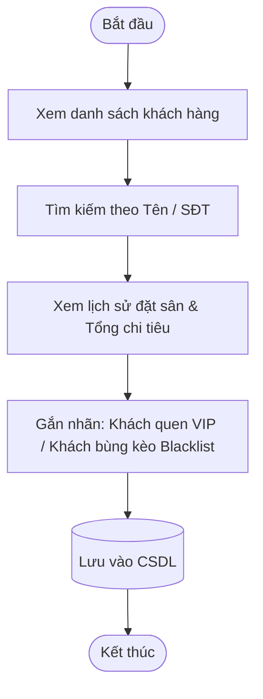
*Hình 3.28 Biểu đồ hoạt động quản lý khách hàng*

| Thuộc tính | Chi tiết |
| :--- | :--- |
| **Mã Use case** | `UC014` |
| **Tên Use case** | **Quản lý khách hàng** |
| **Tác nhân** | Nhân viên, Chủ sân |
| **Sự kiện kích hoạt** | Nhấp vào mục "Khách hàng" trên thanh menu |
| **Tiền điều kiện** | Đã đăng nhập tài khoản quyền Staff hoặc Owner |

**Luồng sự kiện chính (Thành công):**
| STT | Thực hiện bởi | Hành động |
| :---: | :--- | :--- |
| 1. | Nhân viên/Admin | Chọn chức năng "Quản lý khách hàng" |
| 2. | Hệ thống | Hiển thị danh sách khách hàng, số lần đá và tổng chi tiêu |
| 3. | Nhân viên/Admin | Tìm kiếm và xem chi tiết lịch sử đặt sân của khách |
| 4. | Nhân viên/Admin | Ghi chú hoặc gắn nhãn phân loại khách hàng |
| 5. | Hệ thống | Lưu thông tin cập nhật vào hệ thống |

**Luồng sự kiện thay thế:**
| STT | Thực hiện bởi | Hành động |
| :---: | :--- | :--- |
| 3a. | Hệ thống | Thông báo không tìm thấy khách hàng |

**Hậu điều kiện:** Cập nhật thông tin và lịch sử khách hàng.  
*Table 3.15 Đặc tả use case quản lý khách hàng*

```text
+-----------------------------------------------------------------------------------------+
|  DANH SÁCH KHÁCH HÀNG                                                                   |
|  Tìm kiếm: [ Nhập tên hoặc SĐT... ]                                                     |
|  +----+------------------+-------------+-------------+---------------+----------------+ |
|  | STT| Họ tên           | SĐT         | Tổng số trận| Tổng chi tiêu | Phân loại      | |
|  +----+------------------+-------------+-------------+---------------+----------------+ |
|  | 01 | Nguyễn Hữu Giáp  | 0987654321  | 18 trận     | 6.450.000 đ   | [ KHÁCH VIP ]  | |
|  | 02 | Trần Văn Nam     | 0912345678  | 5 trận      | 1.750.000 đ   | [ Thường ]     | |
|  +----+------------------+-------------+-------------+---------------+----------------+ |
+-----------------------------------------------------------------------------------------+
```
*Hình 3.29 UI quản lý khách hàng*

---

### 3.4.15. Quản lý danh mục sân bóng

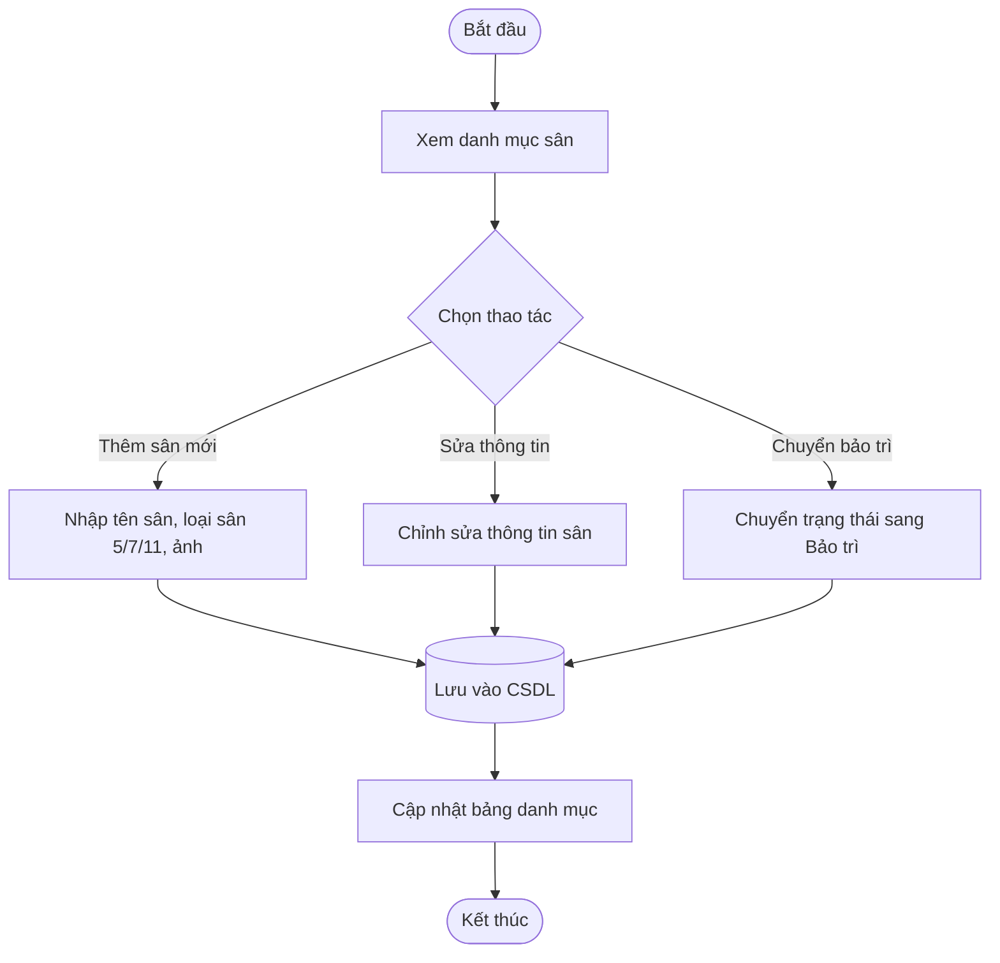
*Hình 3.30 Biểu đồ hoạt động quản lý danh mục sân bóng*

| Thuộc tính | Chi tiết |
| :--- | :--- |
| **Mã Use case** | `UC015` |
| **Tên Use case** | **Quản lý danh mục sân bóng** |
| **Tác nhân** | Chủ sân (Admin) |
| **Sự kiện kích hoạt** | Nhấp vào mục "Sân bóng" trong trang Quản trị |
| **Tiền điều kiện** | Đăng nhập tài khoản quyền Owner |

**Luồng sự kiện chính (Thành công):**
| STT | Thực hiện bởi | Hành động |
| :---: | :--- | :--- |
| 1. | Chủ sân | Chọn chức năng "Quản lý sân bóng" |
| 2. | Hệ thống | Hiển thị danh sách các sân bóng trong cơ sở |
| 3. | Chủ sân | Thêm mới sân bóng hoặc chỉnh sửa thông tin/trạng thái |
| 4. | Chủ sân | Nhấn "Lưu thông tin" |
| 5. | Hệ thống | Kiểm tra tên sân không trùng lặp và lưu vào CSDL |
| 6. | Hệ thống | Hiển thị thông báo thành công |

**Luồng sự kiện thay thế:**
| STT | Thực hiện bởi | Hành động |
| :---: | :--- | :--- |
| 5a. | Hệ thống | Báo lỗi: Tên sân đã tồn tại trong cơ sở |

**Hậu điều kiện:** Danh mục sân bóng được cập nhật.  
*Table 3.16 Đặc tả use case quản lý danh mục sân bóng*

```text
+-----------------------------------------------------------------------------------------+
|  QUẢN LÝ DANH MỤC SÂN BÓNG                                        [ + Thêm sân mới ]    |
|                                                                                         |
|  +----+--------------+----------+-----------+----------------+------------+-----------+ |
|  | STT| Tên sân      | Loại sân | Vị trí    | Mặt cỏ         | Trạng thái | Thao tác  | |
|  +----+--------------+----------+-----------+----------------+------------+-----------+ |
|  | 01 | Sân 5A - Số 1| Sân 5    | Khu A     | Cỏ nhân tạo 5cm| Hoạt động  | [Sửa][Khóa| |
|  | 02 | Sân 7B - VIP | Sân 7    | Khu B     | Cỏ nhân tạo cao| Hoạt động  | [Sửa][Khóa| |
|  +----+--------------+----------+-----------+----------------+------------+-----------+ |
+-----------------------------------------------------------------------------------------+
```
*Hình 3.31 UI quản lý danh mục sân bóng*

---

### 3.4.16. Quản lý khung giờ

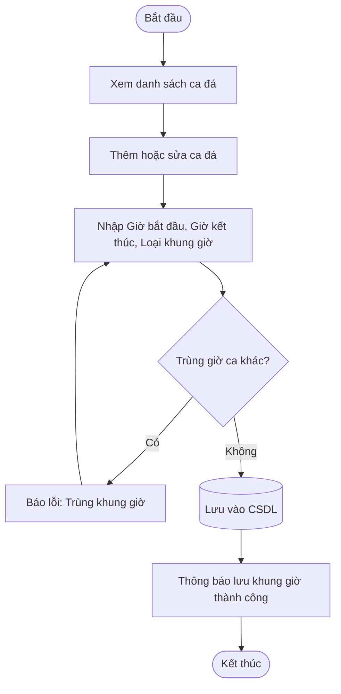
*Hình 3.32 Biểu đồ hoạt động quản lý khung giờ*

| Thuộc tính | Chi tiết |
| :--- | :--- |
| **Mã Use case** | `UC016` |
| **Tên Use case** | **Quản lý khung giờ** |
| **Tác nhân** | Chủ sân (Admin) |
| **Sự kiện kích hoạt** | Nhấp vào mục "Khung giờ" trên menu quản trị |
| **Tiền điều kiện** | Đăng nhập tài khoản quyền Owner |

**Luồng sự kiện chính (Thành công):**
| STT | Thực hiện bởi | Hành động |
| :---: | :--- | :--- |
| 1. | Chủ sân | Chọn chức năng "Quản lý khung giờ" |
| 2. | Hệ thống | Hiển thị danh sách các ca đá hiện có |
| 3. | Chủ sân | Thêm hoặc sửa ca đá (Thời gian bắt đầu, kết thúc, gắn nhãn Giờ vàng) |
| 4. | Chủ sân | Nhấn "Lưu cấu hình" |
| 5. | Hệ thống | Kiểm tra không trùng giờ và lưu vào CSDL |
| 6. | Hệ thống | Hiển thị thông báo cập nhật thành công |

**Luồng sự kiện thay thế:**
| STT | Thực hiện bởi | Hành động |
| :---: | :--- | :--- |
| 5a. | Hệ thống | Báo lỗi: Khung giờ bị trùng hoặc chồng lấn với ca đá khác |

**Hậu điều kiện:** Khung giờ ca đá được cấu hình thành công.  
*Table 3.17 Đặc tả use case quản lý khung giờ*

```text
+-----------------------------------------------------------------------------------------+
|  CẤU HÌNH KHUNG GIỜ CA ĐÁ                                         [ + Thêm ca đá mới ]  |
|                                                                                         |
|  +----+------------+-----------------+---------------+------------------+-------------+ |
|  | STT| Mã ca      | Thời gian       | Thời lượng    | Phân loại        | Thao tác    | |
|  +----+------------+-----------------+---------------+------------------+-------------+ |
|  | 01 | SLOT_01    | 06:00 - 07:30   | 90 phút       | Giờ thường       | [Sửa] [Xóa] | |
|  | 02 | SLOT_02    | 17:30 - 19:00   | 90 phút       | GIỜ VÀNG (Peak)  | [Sửa] [Xóa] | |
|  +----+------------+-----------------+---------------+------------------+-------------+ |
+-----------------------------------------------------------------------------------------+
```
*Hình 3.33 UI quản lý khung giờ*

---

### 3.4.17. Quản lý bảng giá sân

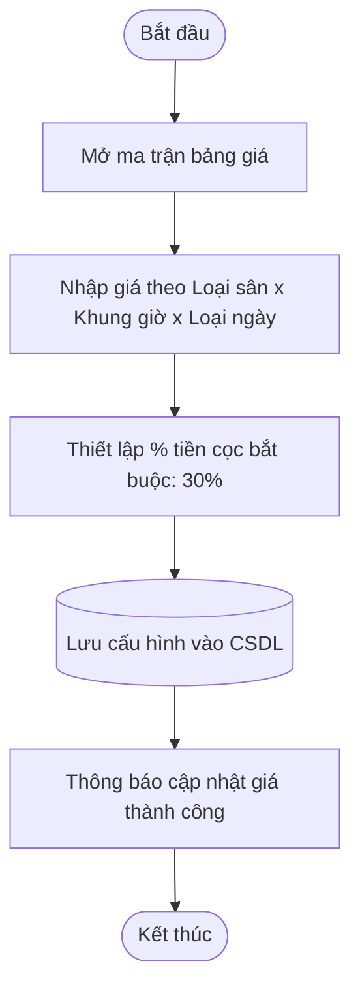
*Hình 3.34 Biểu đồ hoạt động quản lý bảng giá sân*

| Thuộc tính | Chi tiết |
| :--- | :--- |
| **Mã Use case** | `UC017` |
| **Tên Use case** | **Quản lý bảng giá sân** |
| **Tác nhân** | Chủ sân (Admin) |
| **Sự kiện kích hoạt** | Nhấp vào mục "Bảng giá sân" trên menu quản trị |
| **Tiền điều kiện** | Đăng nhập tài khoản quyền Owner |

**Luồng sự kiện chính (Thành công):**
| STT | Thực hiện bởi | Hành động |
| :---: | :--- | :--- |
| 1. | Chủ sân | Chọn chức năng "Quản lý bảng giá sân" |
| 2. | Hệ thống | Hiển thị ma trận bảng giá theo loại sân và khung giờ |
| 3. | Chủ sân | Cập nhật đơn giá cho ngày thường, ngày cuối tuần và % cọc |
| 4. | Chủ sân | Nhấn "Lưu bảng giá" |
| 5. | Hệ thống | Lưu vào CSDL và áp dụng ngay cho các đơn đặt mới |

**Luồng sự kiện thay thế:** Không.  
**Hậu điều kiện:** Bảng giá mới được áp dụng trên toàn hệ thống.  
*Table 3.18 Đặc tả use case quản lý bảng giá sân*

```text
+-----------------------------------------------------------------------------------------+
|  THIẾT LẬP BẢNG GIÁ THUÊ SÂN                                                            |
|  Tỷ lệ đặt cọc bắt buộc: [ 30 ] %                                                       |
|                                                                                         |
|  +--------------+------------------+-----------------------+-----------------------+    |
|  | Loại sân     | Khung giờ        | Giá Ngày thường (T2-T6)| Giá Cuối tuần (T7-CN) |    |
|  +--------------+------------------+-----------------------+-----------------------+    |
|  | Sân 5 người  | Giờ thường       | [ 200.000 ] VNĐ       | [ 250.000 ] VNĐ       |    |
|  | Sân 5 người  | Giờ vàng (17-21h)| [ 350.000 ] VNĐ       | [ 400.000 ] VNĐ       |    |
|  | Sân 7 người  | Giờ vàng (17-21h)| [ 600.000 ] VNĐ       | [ 700.000 ] VNĐ       |    |
|  +--------------+------------------+-----------------------+-----------------------+    |
|                                                     [ HỦY ]   [ LƯU THAY ĐỔI BẢNG GIÁ ] |
+-----------------------------------------------------------------------------------------+
```
*Hình 3.35 UI quản lý bảng giá sân*

---

### 3.4.18. Xem báo cáo thống kê

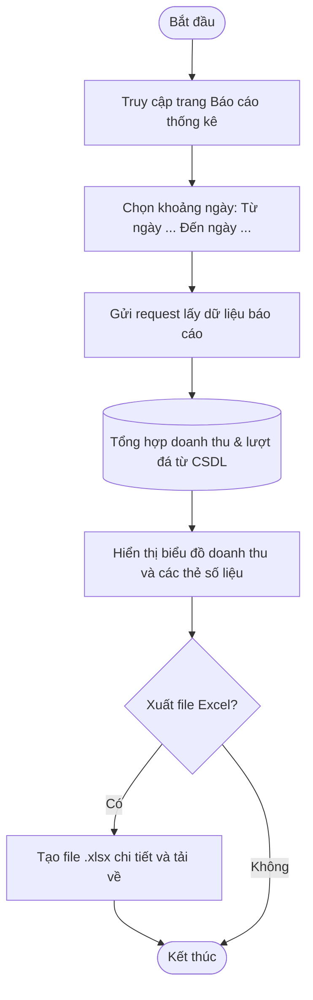
*Hình 3.36 Biểu đồ hoạt động xem báo cáo thống kê*

| Thuộc tính | Chi tiết |
| :--- | :--- |
| **Mã Use case** | `UC018` |
| **Tên Use case** | **Xem báo cáo thống kê** |
| **Tác nhân** | Chủ sân (Admin) |
| **Sự kiện kích hoạt** | Nhấp vào mục "Báo cáo thống kê" trên menu quản trị |
| **Tiền điều kiện** | Đăng nhập tài khoản quyền Owner |

**Luồng sự kiện chính (Thành công):**
| STT | Thực hiện bởi | Hành động |
| :---: | :--- | :--- |
| 1. | Chủ sân | Chọn chức năng "Báo cáo thống kê" |
| 2. | Chủ sân | Chọn khoảng thời gian cần xem báo cáo |
| 3. | Hệ thống | Tổng hợp số liệu từ CSDL và render biểu đồ doanh thu, tỷ lệ lấp đầy sân |
| 4. | Chủ sân | (Tùy chọn) Nhấn nút "Xuất file Excel" để tải file báo cáo về máy tính |

**Luồng sự kiện thay thế:** Không.  
**Hậu điều kiện:** Báo cáo doanh thu và hiệu suất sân được hiển thị chi tiết.  
*Table 3.19 Đặc tả use case xem báo cáo thống kê*

```text
+-----------------------------------------------------------------------------------------+
|  BÁO CÁO THỐNG KÊ DOANH THU & HIỆU SUẤT SÂN                                             |
|  Từ ngày: [ 01/08/2026 ]  Đến ngày: [ 20/08/2026 ]  [ Lọc dữ liệu ]   [ 📥 Xuất Excel ] |
|                                                                                         |
|  +----------------------+  +----------------------+  +----------------------+           |
|  | TỔNG DOANH THU       |  | TỔNG LƯỢT ĐẶT SÂN    |  | TỶ LỆ LẤP ĐẦY SÂN    |           |
|  | 48.500.000 VNĐ       |  | 142 lượt             |  | 82.5 %               |           |
|  +----------------------+  +----------------------+  +----------------------+           |
|                                                                                         |
|  [ BIỂU ĐỒ DOANH THU THEO NGÀY ]                 [ CƠ CẤU DOANH THU ]                   |
|  |      *                                        |   - Tiền thuê sân:   85%             |
|  |    * *   *                                    |   - Nước giải khát:  12%             |
|  |  * * * * * *                                  |   - Thuê bóng, áo:    3%             |
|  +--------------------> (Ngày trong tháng)       +-------------------------+            |
+-----------------------------------------------------------------------------------------+
```
*Hình 3.37 UI xem báo cáo thống kê*

---

## 3.5. Yêu cầu phi chức năng

- **Môi trường phía máy khách (Client-side):** Người dùng có thể sử dụng mượt mà trên các trình duyệt web hiện đại như Google Chrome, Microsoft Edge, Mozilla Firefox, Safari trên cả máy tính để bàn (Desktop) và điện thoại thông minh (Responsive Mobile).
- **Khả năng chịu tải và đồng thời (Concurrency):** Hệ thống hỗ trợ nhiều người dùng truy cập, tìm kiếm và đặt sân cùng lúc mà không xảy ra tình trạng xung đột đặt trùng sân (Double Booking) nhờ cơ chế khóa tạm thời (Lock slot 10 phút).
- **Bảo mật dữ liệu (Security):** Mật khẩu người dùng được mã hóa một chiều qua thuật toán **BCrypt**. Toàn bộ các API nghiệp vụ được bảo vệ bởi chuẩn xác thực **JWT (JSON Web Token)** với phân quyền nghiêm ngặt theo Role (Owner, Staff, Customer).
- **Tương thích thanh toán:** Tích hợp giao thức an toàn (Checksum SHA256 / IPN Webhook) khi giao tiếp với cổng thanh toán VNPAY / MoMo.
- **Tính khả dụng (Availability):** Hệ thống đảm bảo sẵn sàng hoạt động 24/7.
